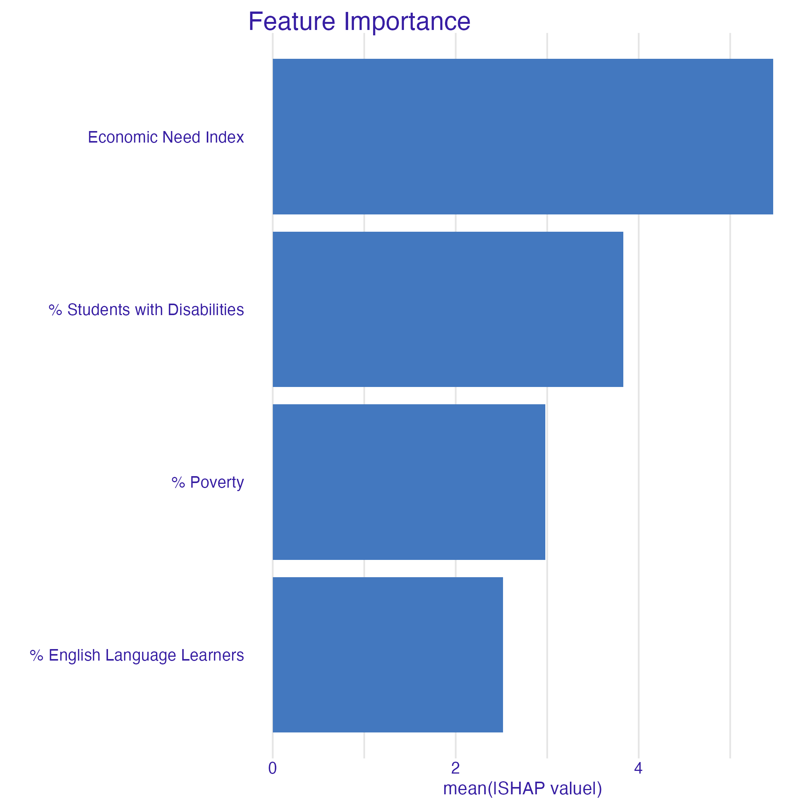
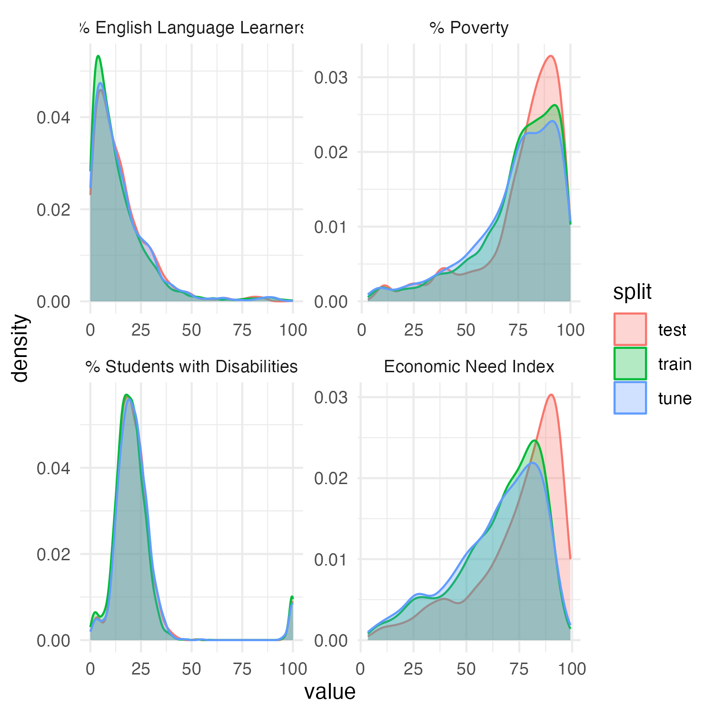

# Structural Predictors of Chronic Absenteeism in NYC Public Schools

## Table of Contents
- [Project Context](#project-context)
- [Repository Structure](#repository-structure) 
- [Introduction](#introduction)
- [Dataset](#dataset)
- [Methods](#methods)
- [Key Findings](#key-findings)
- [Data Limitations](#data-limitations)
- [Future Work](#future-work)
---

## Project Context
This repository contains the code, plots, and findings for a MTH 4330 final project at Baruch College (Spring 2026). The final report (PDF) and slide deck are included in this repo.
 
**Contributors:** Daisy Chen · Khushi Gandhi · Safa Tahir · Sonia Tyburczy

---

## Repository Structure

```
├── data/
│   ├── raw/                        # Original NYC DOE source files (attendance, demographics, performance)
│   ├── processed/                  # Cleaned and merged datasets; train/tune/test splits
│   ├── model_data/                 # Model outputs (results, best params, tune metrics) by model
│   │   ├── mlr/
│   │   ├── poly/
│   │   ├── rf/
│   │   └── xgb/
│   └── diagnostics/                # KS test CSVs and row count summary
├── models/                         # Model training scripts (mlr.r, poly.r, rf.r, xgb.r)
├── plots/                          # All generated figures
│   ├── diagnostics/                # Density plots & clipping analysis
│   ├── poly_plots/                 # Train/tune/test plots by degree for RMSE, MSE, R², and adj. R²
│   ├── rf_plots/                   # SHAP importance & contribution plots for RF
│   └── xgb_plots/                  # SHAP importance & contribution plots for XGBoost
├── scripts/
│   ├── data_handling/              # Merging, splitting, row count scripts
│   ├── diagnostics/                # KS tests, density graphs, clipped model runs
│   ├── graphs.r                    # Shared plotting utilities
│   └── utils.r                     # Shared evaluation metrics (RMSE, MSE, R², adj. R²) and evaluate_splits() helper
├── report.pdf
└── slides.pdf
```

---

## Introduction
 
Chronic absenteeism is a significant structural barrier to student success, and its leading drivers remain difficult to isolate. This project frames school-level chronic absenteeism prediction in NYC public schools as a supervised regression task, using demographic and socioeconomic features drawn from publicly available NYC DOE data spanning 2013–2018.
 
Rather than focusing on individual student behavior, we focus on **school-level structural predictors**—economic need, poverty, English language learner status, and disability status—to understand what institutional conditions are most associated with high chronic absenteeism rates.
 
---
 
## Dataset
 
We merged two NYC DOE Open Data sources:
 
- [Attendance Results Dataset (2013–2019)](https://data.cityofnewyork.us/Education/Attendance-Results-2013-2019/mg8s-7r2b/about_data)
- [Demographic Snapshot School Dataset (2013–2018)](https://data.cityofnewyork.us/Education/2013-2018-Demographic-Snapshot-School/s52a-8aq6/about_data)
  
Datasets are joined on DBN and year. The merged dataset contains **7,607 observations** across 50 features. All analysis uses percentage-based features rather than raw counts to ensure comparability across schools of different sizes.
 
**Data splits** reflect a temporal structure to simulate a realistic forecasting scenario:
 
| Split | Years | Rows |
|-------|-------|------|
| Train | 2013–2016 | 4,540 |
| Tune  | 2016–2017 | 1,530 |
| Test  | 2017–2018 | 1,537 |
 
The four structural predictors used throughout are:
- **ENI** — Economic Need Index
- **% Poverty**
- **% English Language Learners (ELL)**
- **% Students with Disabilities (SWD)**

---
## Methods
 
We evaluated four models in order of complexity:
 
1. **Multiple Linear Regression (MLR)** — OLS baseline on all four predictors
2. **Polynomial Regression** — Extended baseline replacing the linear ENI term with polynomial degrees 1–10, while keeping the other three predictors linear
3. **Random Forest (RF)** — 5-fold CV tuning over `mtry` (1–4) and minimum node size (2–20); 500 trees
4. **XGBoost** — 5-fold CV tuning over number of trees (100–1000), tree depth (3–8), and learning rate (0.001–0.1)
SHAP (TreeSHAP) values were computed on the test set for both RF and XGBoost to examine feature-level contributions.
 
---
 
## Key Findings
 
**XGBoost was the most reliable model overall**, achieving the smallest train-to-test RMSE gap of any method:
 
| Model | Train RMSE | Tune RMSE | Test RMSE | Test R² |
|-------|-----------|-----------|-----------|---------|
| MLR | 10.608 | 10.572 | 10.950 | 0.506 |
| RF | 5.769 | 10.026 | 11.386 | 0.466 |
| XGBoost | 9.280 | 9.697 | 10.736 | 0.526 |
 
Random Forest showed the most severe overfitting, with train R² of 0.857 collapsing to 0.466 on test—a warning sign given that cross-validation had already pushed the model toward greater regularization.
 
**On feature importance:**
- **ENI** was the dominant predictor by SHAP magnitude in XGBoost, consistent with its role as an aggregate economic need measure
- **% Students with Disabilities** ranked second in XGBoost—ahead of % Poverty and % ELL—suggesting it captures genuinely independent structural barriers to attendance (medical appointments, health-related absences) not reducible to economic need

 
---
 
## Data Limitations
 
In the 2017–18 school year, NYC DOE implemented a new data matching process that caused a sharp increase in both ENI and % Poverty values. ENI's modal value jumped from ~72 in 2016–17 to ~91 in 2017–18. This reflects a methodological shift, not a real change in economic conditions. This is documented in the later [2017–18 to 2021–22 Demographic Snapshot](https://data.cityofnewyork.us/Education/2017-18-to-2021-22-Demographic-Snapshot-School/vmmu-dde2) but not in our dataset.
 
This shift explains the divergence between tune and test error across all models and is the primary constraint on predictive performance. A random split, which mixes years, artificially suppresses test error by leaking post-2017 observations into training, which is why we adopted the temporal split.
 

 
---
 
## Future Work
 
- **Year × ENI interaction term** to explicitly model temporal instability in ENI across administrative redefinitions
- **Graduation outcome extension** using NYC DOE High School Performance Directories (2013–2018), to trace how structural absenteeism drivers translate into longer-term student outcomes
- Further investigate ENI as a structural predictor and the implications of its administrative redefinition
